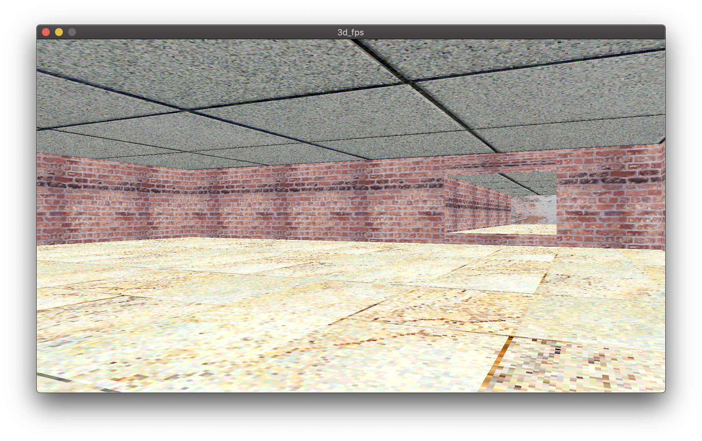
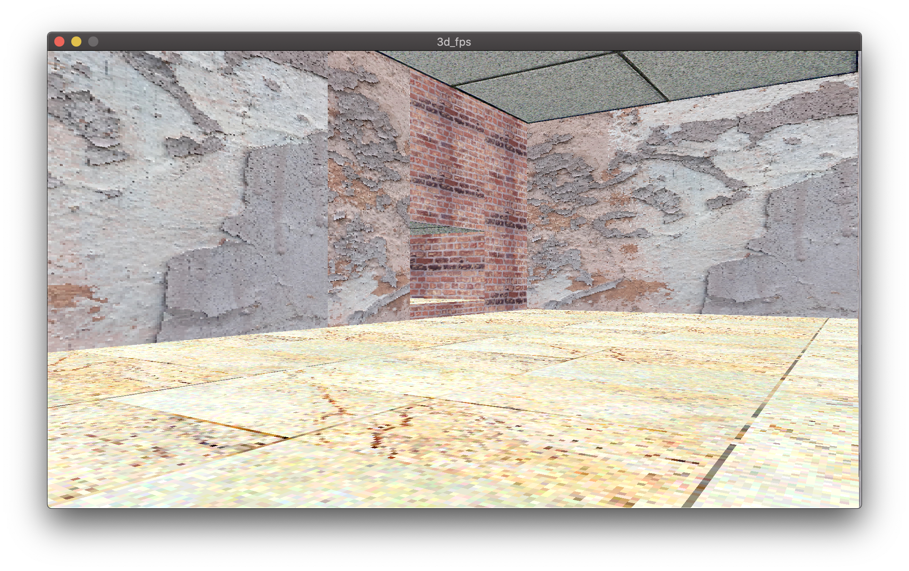
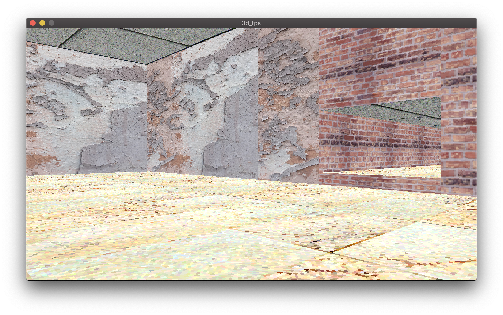

# 3d_fps

A Rust project to create a 3D DOOM style engine.

## Features

3d_fps boasts:

 - Perspective-correct texture-mapped walls, ceilings, and floors
 - A Duke-Nukem style 'portal' based renderer
 - Arbitrarily high-resolution texture support
 - Recreated DOOM 'drifter' movement
 - The lowest FPS you've ever seen

## About

The engine is based on the ideas put forward in
[Bisqwit's video](https://youtu.be/HQYsFshbkYw)
(but isn't a direct port of his code).

This was a great learning project for me, not
least because DOOM 2 is one of my favourite
games of all time.

I plan to eventually add online deathmatch.

However, there is a problem. It is incredibly
slow. On my Macbook, it can manage around 25 FPS
tops, 35 on some other machines I've tried. By
the time I'd got the engine to this state over
a week or so, I didn't feel like debugging this,
but I'll come back to it.

## Compiling/Running

Clone the repo and use `cargo run --release` (the
app must run in release to get a "playable" FPS).

You'll need SFML and CSFML (the graphics lib) to run
3d_fps, you can get them [here](https://github.com/jeremyletang/rust-sfml/wiki)

I've managed to get it running under macOS and Windows.
An i9 9900 and Vega 48 were required to get 35 FPS on the
current build.
